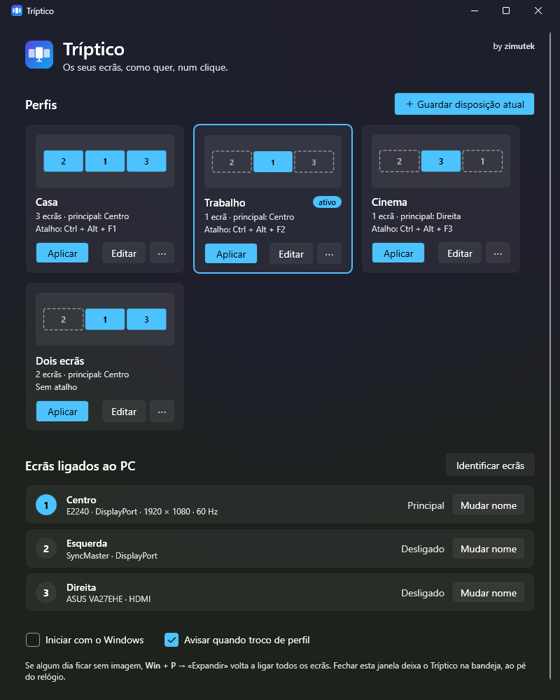

<p align="center">
  
</p>

<h1 align="center">Tríptico</h1>

<p align="center">
  <b>Perfis de ecrãs para Windows.</b><br>
  Ligue e desligue monitores, e ponha cada um no seu sítio, num clique ou com um atalho.<br>
  <sub>by zimutek</sub>
</p>

<p align="center">
  <a href="README.md">Read me in English</a> · Windows 10 / 11 · .NET 10 · MIT
</p>

<p align="center">
  
</p>

---

> ### Leia isto primeiro
>
> **Escrito por IA.** Esta aplicação (código, ícone e este texto) foi escrita por IA
> (Claude, da Anthropic, através do Claude Code) a pedido do autor, e é partilhada tal como está.
>
> **Testado numa secretária.** Foi feita para a montagem do autor, com três monitores, uma placa
> gráfica, dois ecrãs DisplayPort e um HDMI. A deteção, a edição de perfis, os atalhos e a bandeja
> foram testados aí. Todos os tipos de mudança de perfil foram verificados com o ensaio do próprio
> Windows (`SDC_VALIDATE`), que diz se o Windows aceitaria a mudança sem a fazer. Outras placas,
> portáteis, docks e ligações em cadeia não foram testados.
>
> **Se algum ecrã ficar sem imagem:** <kbd>Win</kbd> + <kbd>P</kbd> → *Expandir* volta sempre a
> ligar todos. Sem garantia de qualquer tipo, ver a [LICENSE](LICENSE).

---

## Para quê

Quem partilha monitores entre dois PCs conhece o filme. Dois dos três ecrãs passam para o PC do
trabalho, mas o seu PC continua a achar que eles lá estão: as janelas abrem onde não as vê e o
rato foge pela borda. A solução é ir às *Definições → Sistema → Ecrã* todas as manhãs e voltar
atrás todas as noites.

As ferramentas que fazem isto bem costumam ser pagas ou esconder a função no meio de cem outras.
O Tríptico faz uma coisa só: **perfis de ecrãs**, um atalho para cada um.

```text
 Casa       [ 2 ][ 1 ][ 3 ]     Ctrl + Alt + F1    os três lado a lado
 Trabalho        [ 1 ]          Ctrl + Alt + F2    só o que fica
 Cinema               [ 3 ]     Ctrl + Alt + F3    só o ecrã grande
```

## O que faz

- **Perfis editáveis**: que ecrãs ficam ligados, qual é o principal e onde fica cada um. Cada
  perfil mostra uma miniatura da disposição.
- **Dois pontos de partida**: *Guardar disposição atual* transforma o que tem agora num perfil;
  *Criar perfis sugeridos* cria «todos os ecrãs» mais um perfil para cada ecrã sozinho, já com
  atalhos.
- **Atalhos globais**, que funcionam com a janela fechada. O editor avisa quando um atalho
  estragaria a escrita: no teclado português, Ctrl + Alt *é* o AltGr, e Ctrl + Alt + 2
  levava-lhe o `@`.
- **Menu na bandeja** com os perfis e o ativo assinalado.
- **Identificar ecrãs**: um número grande em cada monitor durante três segundos.
- **Nomes próprios** para os ecrãs («Esquerda», «Portátil»…).
- **Linha de comandos**, para atalhos no ambiente de trabalho, Stream Deck ou scripts.
- **Arranque com o Windows**, opcional e sem precisar de administrador.

## Funciona com qualquer combinação de monitores?

Funciona com os ecrãs que o próprio Windows vê, porque usa a mesma API das *Definições → Ecrã*.

| Situação | Estado |
|---|---|
| Qualquer número de ecrãs, em qualquer disposição | **Suportado** |
| DisplayPort, HDMI, DVI, USB-C, ecrã do portátil | **Suportado**: o que o Windows mostrar |
| Dois monitores iguais | **Suportado**: distinguidos pela porta onde estão ligados |
| Desligar o principal ou o do meio | **Suportado**: outro passa a principal e os restantes encostam-se, sem buracos |
| Ecrã desligado da tomada ou noutra entrada, que o Windows já não vê | **Ignorado**: o resto do perfil aplica-se e um aviso diz qual faltou |
| Mais ecrãs do que a placa gráfica consegue ligar ao mesmo tempo | **Em parte**: liga os que a placa aguenta e avisa dos outros |
| Duas placas gráficas | Deve funcionar, **não testado** |
| Docks, cadeias MST, adaptadores DisplayLink | **Não testado** |
| Modo duplicar (espelho) | **Não suportado**: os perfis expandem sempre o ambiente de trabalho |
| Resolução, frequência, escala, rotação, HDR | **Não ficam no perfil**: o Windows repõe as definições de cada ecrã quando ele volta |

Os ecrãs são reconhecidos pelo caminho do dispositivo, que se mantém entre arranques. Se esse
mudar (por exemplo, depois de reinstalar os drivers), o Tríptico usa o modelo que vem no EDID do
monitor.

## Instalar

**Requisitos:** Windows 10 ou 11 (x64) e o
[.NET 10 Desktop Runtime](https://dotnet.microsoft.com/download/dotnet/10.0), ou a versão
autónoma, que não precisa de mais nada.

```powershell
.\tools\publicar.ps1              # compila um .exe e instala-o para o utilizador atual
.\tools\publicar.ps1 -Autonomo    # .exe que corre em qualquer PC, sem .NET instalado (~70 MB)
.\tools\publicar.ps1 -SemInstalar # só compila, para .\publicar
```

Fica em `%LOCALAPPDATA%\Programs\Triptico`, com **Tríptico** no menu Iniciar. O executável não
está assinado, por isso o SmartScreen pode perguntar primeiro: *Mais informações → Executar mesmo
assim*.

## Usar

1. Abra o **Tríptico** no menu Iniciar.
2. Clique em **Criar perfis sugeridos**, ou arrume os ecrãs no Windows como gosta e clique em
   **Guardar disposição atual**.
3. Em **Editar**, mude o nome, marque os ecrãs que ficam ligados, escolha o principal e grave um
   atalho.
4. Feche a janela. O Tríptico fica na bandeja, ao pé do relógio, e os atalhos continuam a
   funcionar. Marque **Iniciar com o Windows** para estar sempre lá.

## Linha de comandos

```text
Triptico.exe --perfil "Trabalho"   aplica o perfil e sai
Triptico.exe --listar              mostra ecrãs e perfis
Triptico.exe --testar "Trabalho"   pergunta ao Windows se aceitaria o perfil, sem mudar nada
Triptico.exe --bandeja             arranca escondido na bandeja
```

Código de saída `0` é sucesso, `1` falha, `2` perfil inexistente.

## Como funciona

Usa a **API CCD** do Windows (`QueryDisplayConfig` / `SetDisplayConfig`), a mesma das
*Definições → Ecrã* e do <kbd>Win</kbd> + <kbd>P</kbd>. Aplicar um perfil tem dois passos:

1. **Topologia, ou seja, que ecrãs ficam ligados.** Primeiro pede ao Windows a disposição que ele
   já conhece para esse conjunto de ecrãs. Se o Windows nunca viu essa combinação, os ecrãs que
   ficam mantêm os modos e o Windows completa os novos. Em último caso, o Windows escolhe tudo.
2. **Disposição, ou seja, onde fica cada um.** Aplica as posições guardadas e põe o principal na
   origem. Se o perfil deixa um buraco (o ecrã do meio desligado), os outros encostam-se, sem
   buracos nem sobreposições.

Perfis, nomes e opções ficam em `%APPDATA%\Triptico\definicoes.json`, com um pequeno registo de
diagnóstico em `registo.txt`. A variável `TRIPTICO_DADOS` aponta para outra pasta (cópia
portátil, testes), e uma cópia com pasta própria corre ao lado da instalada.

## Compilar

```powershell
dotnet build src/Triptico
dotnet run --project src/Triptico -- --listar
```

**Não aplique perfis a sério durante testes**, porque mexe nos seus ecrãs. Use `--testar` com
`TRIPTICO_DADOS` a apontar para uma pasta de testes.

## Próximos passos

- Mudar a entrada dos monitores por **DDC/CI**, para um atalho passar a secretária toda de um PC
  para o outro sem carregar nos botões dos monitores
- Interface em inglês
- Versões assinadas nas Releases do GitHub
- Resolução e frequência por perfil, opcionais

## Licença

MIT, ver a [LICENSE](LICENSE).
