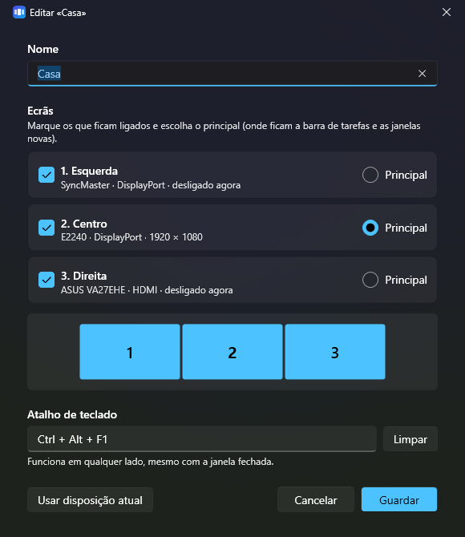

<p align="center">
  
</p>

<h1 align="center">Tríptico</h1>

<p align="center">
  <b>Display profiles for Windows.</b><br>
  Turn monitors on and off, and put them back where they belong, with one click or one hotkey.<br>
  <sub>by zimutek</sub>
</p>

<p align="center">
  <a href="LEIAME.md">Leia-me em português</a> · Windows 10 / 11 · .NET 10 · MIT
</p>

<p align="center">
  <a href="https://github.com/zimutes/triptico/actions/workflows/compilar.yml"></a>
</p>

<p align="center">
  
</p>

---

> ### Read this first
>
> **Written by AI.** This app (the code, the icon and this README) was written by AI
> (Claude, by Anthropic, through Claude Code) at the author's request, and is shared as-is.
>
> **Tested on one desk.** It was built for the author's own three-monitor setup: one GPU,
> two DisplayPort screens and one HDMI. Detection, profile editing, hotkeys and the tray were
> tested there, and turning every display back on was done for real. The other kinds of
> change were checked with Windows' own dry run (`SDC_VALIDATE`), which tells you whether
> Windows would accept a change without making it. Other GPUs, laptops, docks and
> daisy-chains have not been tested.
>
> **The interface is in Portuguese** (pt-PT) for now.
>
> **If a screen ever stays dark:** right-click the tray icon and pick *Ligar todos os ecrãs*
> (turn all displays on). It's there even before you create any profile.
> <kbd>Win</kbd> + <kbd>P</kbd> → *Extend* helps too, but it brings back the last set of
> displays Windows remembers, which isn't always all of them. No warranty of any kind, see
> [LICENSE](LICENSE).

---

## Why

Share monitors between two computers and you know the drill. Two of your three screens
switch over to the work laptop, but your own PC still thinks they are there. New windows
open where you can't see them and the mouse wanders off the edge of the desk. The fix is
*Settings → System → Display → Disconnect this display*, twice every morning, then back
again every evening.

The tools that do this properly tend to be paid, or bury it under a hundred other options.
Tríptico does one thing: **profiles for your displays**, one hotkey each.

```text
 Home       [ 1 ][ 2 ][ 3 ]     Ctrl + Alt + F1    all three, side by side
 Work            [ 2 ]          Ctrl + Alt + F2    just the one that stays
 Movie                [ 3 ]     Ctrl + Alt + F3    only the big screen
```

## Features

- **Profiles you can edit.** Choose which displays stay on, which one is the primary, and
  where each one sits. A miniature on every card shows the layout at a glance.
- **Two ways to start.** *Save current layout* turns whatever you have now into a profile.
  *Create suggested profiles* makes "all screens" plus one profile for each screen alone,
  with hotkeys already assigned.
- **Global hotkeys** that keep working while the window is closed. The editor warns you
  about combinations that would break typing: on many European layouts Ctrl + Alt *is*
  AltGr, so Ctrl + Alt + 2 would cost you the `@`.
- **Turn a single display on or off** straight from the list, or **all of them at once**.
  No profile needed.
- **Tray menu** listing your profiles, with the active one ticked, plus *turn all displays on*.
- **Identify displays** puts a large number on every screen for three seconds. Displays are
  numbered left to right as they sit on your desk, whether they're on or off right now.
- **Your own names** for displays ("Left", "Laptop"…), used everywhere in the app.
- **Command line**, for desktop shortcuts, Stream Deck buttons or scripts.
- **Starts with Windows** if you want it to. No administrator rights needed, ever.

<p align="center">
  
</p>

## Does it work with any combination of monitors?

It works with any displays Windows itself can see, because it drives the same API as
*Settings → Display*. The details:

| Situation | Status |
|---|---|
| Any number of displays, in any arrangement | **Supported** |
| DisplayPort, HDMI, DVI, USB-C, a laptop's own panel | **Supported**: whatever Windows lists |
| Two identical monitors | **Supported**: told apart by the port they're plugged into |
| Turning off the primary or the middle display | **Supported**: another becomes primary, the rest slide together so no gap is left |
| A display that is unplugged, or switched to another input and gone from Windows | **Skipped**: the rest of the profile applies and a notification names the missing display |
| More displays than the graphics card can drive at once | **Partly**: applies what the card can drive and reports the rest |
| Two graphics cards | Expected to work, **untested** |
| Docks, MST daisy-chains, DisplayLink adapters | **Untested** |
| Duplicate (mirror) mode | **Not supported**: profiles always extend the desktop |
| Resolution, refresh rate, scaling, rotation, HDR | **Not stored in profiles**: Windows restores each display's own settings when it comes back |

Displays are recognised by their device path, which stays the same across reboots. If
that changes (after a driver reinstall, say), Tríptico falls back to the model number in
the monitor's EDID.

## Install

**Requirements:** Windows 10 or 11 (x64).

**Download** from [Releases](https://github.com/zimutes/triptico/releases) when one is
published:

- `Triptico.exe` is small but needs the
  [.NET 10 Desktop Runtime](https://dotnet.microsoft.com/download/dotnet/10.0).
- `Triptico-autonomo-win-x64.zip` is self-contained and runs with nothing else installed.

Each release is built by [GitHub Actions](.github/workflows/publicar.yml) from the tagged
source and comes with `SHA256SUMS`.

**Or build and install from source.** Clone the repository and run, from PowerShell:

```powershell
.\tools\publicar.ps1              # builds one .exe and installs it for the current user
.\tools\publicar.ps1 -Autonomo    # self-contained .exe that runs on any PC (~70 MB)
.\tools\publicar.ps1 -SemInstalar # build only, into .\publicar
```

It installs to `%LOCALAPPDATA%\Programs\Triptico` and adds **Tríptico** to the Start menu.
No administrator rights needed. The executable is unsigned, so Windows SmartScreen may ask
first: *More info → Run anyway*.

### Uninstall

```powershell
.\tools\desinstalar.ps1           # closes the app, removes the files, shortcut and autostart
.\tools\desinstalar.ps1 -Tudo     # …and your profiles too
.\tools\desinstalar.ps1 -WhatIf   # show what it would remove, delete nothing
```

Profiles stay in `%APPDATA%\Triptico` unless you pass `-Tudo`, so a reinstall finds them
again.

## Using it

1. Open **Tríptico** from the Start menu. To switch a display right away, use **Ligar** /
   **Desligar** (*on* / *off*) next to it, or **Ligar todos** (*all on*).
2. For hotkeys, turn on the displays you use at home first, then click **Criar perfis
   sugeridos** (*create suggested profiles*): it saves that layout as "all screens". Or arrange
   your screens the way you like and click **Guardar disposição atual** (*save current layout*).
3. **Editar** (*edit*) a profile to rename it, tick the displays that stay on, pick the
   primary and record a hotkey.
4. Close the window. Tríptico stays in the tray, next to the clock, and the hotkeys keep
   working. Tick **Iniciar com o Windows** (*start with Windows*) so it's always there.

## Command line

```text
Triptico.exe --perfil "Trabalho"   apply a profile and exit
Triptico.exe --listar              list displays and profiles
Triptico.exe --testar "Trabalho"   ask Windows whether it would accept the profile, change nothing
Triptico.exe --ligar-todos         turn every connected display on
Triptico.exe --bandeja             start hidden in the tray
```

Exit code `0` means success, `1` failure, `2` no such profile.

## How it works

Tríptico talks to the Windows **CCD API** (`QueryDisplayConfig` / `SetDisplayConfig`),
the same one behind *Settings → Display* and <kbd>Win</kbd> + <kbd>P</kbd>. Applying a
profile takes two steps:

1. **Topology: which displays are on.** First it asks Windows for the layout it already
   remembers for that exact set of displays. If Windows has never seen that combination,
   the displays that stay on keep their current modes and Windows fills in the new ones.
   As a last resort Windows picks everything itself.
2. **Layout: where each one goes.** The positions saved in the profile are applied and the
   primary display is moved to the origin. When a profile leaves a hole (the middle screen
   is off), the others slide together so there's no gap and no overlap.

Profiles, display names and options live in `%APPDATA%\Triptico\definicoes.json`, with a
small diagnostic log next to it in `registo.txt`. Set the `TRIPTICO_DADOS` environment
variable to use another folder, for a portable copy or for testing. A copy with its own
folder runs alongside the installed one.

## Building

```powershell
dotnet build src/Triptico
dotnet run --project src/Triptico -- --listar
```

```text
src/Triptico/
  Display/    CCD interop, reading and applying configurations, gap-free layout
  Profiles/   profile model and settings file
  Services/   global hotkeys, tray icon, start with Windows
  Views/      WPF windows (Fluent theme, follows Windows light/dark)
tools/
  publicar.ps1      build and install
  desinstalar.ps1   remove it again
  gerar-icone.ps1   regenerate the icon
.github/workflows/
  compilar.yml      build check on every push
  publicar.yml      release on every v* tag (git tag v1.0.0 && git push origin v1.0.0)
```

**Please don't apply real profiles while testing.** It rearranges your actual screens.
Use `--testar` together with `TRIPTICO_DADOS` pointing at a test folder.

## Roadmap

- Switch monitor inputs over **DDC/CI**, so one hotkey moves the whole desk between PCs
  without pressing buttons on the monitors
- English interface
- Signed builds on GitHub Releases
- Optional resolution and refresh rate per profile

## License

MIT, see [LICENSE](LICENSE).
